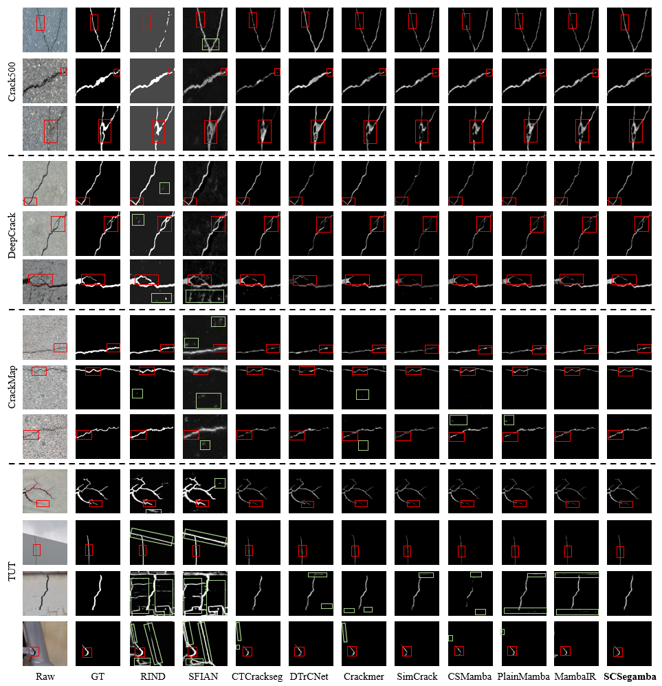
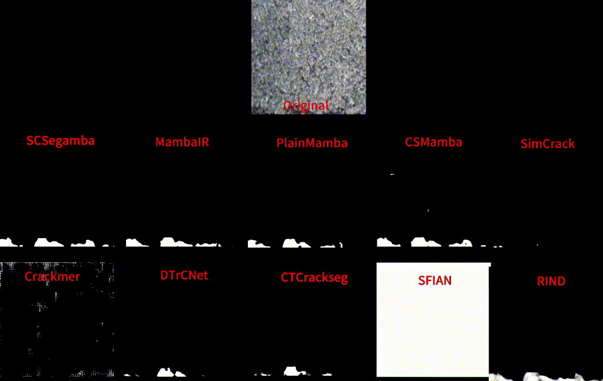

<div align="center">
  <h1>SCSegamba</h1>
</div>
<p align="center">
    
</p>


<div align="center">
<h4>[CVPR2025] SCSegamba: Lightweight Structure-Aware Vision Mamba for Crack Segmentation in Structures</h4>
</div>

<div align="center">
<h6>🌟 If this work is useful to you, please give this repository a Star! 🌟</h6>
</div>

<div align="center">
  <a href="https://arxiv.org/abs/2503.01113"></a>
  <a href="https://www.apache.org/licenses/" style="margin-left:10px;"></a>
</div>
<<<<<<< HEAD
## 📬News

- **2025-03-05**: We added a description of the the methodology and visualization of the experimental results in ReadMe💭!
=======


## 📬News

>>>>>>> fa6d10958cbcf1f3ca12e96b7aeef0ba30869bcd
- **2025-03-04**: The code for **SCSegamba** is publicly available in this repository📦!
- **2025-03-04**: The preprint of **SCSegamba** has been posted on [**📤️arXiv**](https://arxiv.org/abs/2503.01113)!
- **2025-03-01**: In the next few days, we will make some minor revisions and then publish the preprint on arXiv. The code will also be released shortly after the paper is published! **Stay tuned🥰**!
- **2025-02-27**: 🎉🎉🎉 We are thrilled to announce that our **SCSegamba** has been accepted to **CVPR 2025**! 

## 🛠️ Method Overview

<p align="center">
    
</p>

Pixel-level segmentation of structural cracks across various scenarios remains a considerable challenge. Current methods encounter challenges in effectively modeling crack morphology and texture, facing challenges in balancing segmentation quality with low computational resource usage. To overcome these limitations, we propose a lightweight Structure-Aware Vision Mamba Network (**SCSegamba**), capable of generating high-quality pixel-level segmentation maps by leveraging both the morphological information and texture cues of crack pixels with minimal computational cost. Specifically, we developed a **S**tructure-**A**ware **V**isual **S**tate Space module (**SAVSS**), which incorporates a lightweight **G**ated **B**ottleneck **C**onvolution (**GBC**) and a **S**tructure-**A**ware **S**canning **S**trategy (**SASS**). The key insight of GBC lies in its effectiveness in modeling the morphological information of cracks, while the SASS enhances the perception of crack topology and texture by strengthening the continuity of semantic information between crack pixels. Experiments on crack benchmark datasets demonstrate that our method outperforms other state-of-the-art (SOTA) methods, achieving the highest performance with only 2.8M parameters. On the multi-scenario dataset, our method reached 0.8390 in F1 score and 0.8479 in mIoU.

## 🕹Getting Started

#### Environment Setup

You can create your own conda environment for SCSegamba based on the following command⚙️:

```shell
conda create -n SCSegamba python=3.10 -y
conda activate SCSegamba
pip install torch==1.13.1+cu116 torchvision==0.14.1+cu116 -f https://download.pytorch.org/whl/torch_stable.html
pip install -U openmim
mim install mmcv-full
pip install mamba-ssm==1.2.0
pip install timm lmdb mmengine numpy
```

#### Run

You can modify the parameters in the **main.py** file and run it with the following command:

``````shell
python main.py
``````

You can also use checkpoints for inference with the following command:

```shell
python test.py
```

Use the following commands to calculate the ODS, OIS, P, R, F1, mIoU metrics (You can find the SCSegamba test results on the TUT dataset in the `./results/results_test/TUT_results/` path and calculate the metrics using the following command.):

```shell
python eval_compute.py
cd eval
python evaluate.py
```

You can also follow the steps below to validate the results of our experiments on the TUT dataset

<<<<<<< HEAD
- **Download Checkpoint**: Get the [checkpoint_TUT](https://drive.google.com/file/d/1r36WUaCoeNjtfZN9BRS-uPMcRglQTGx3/view?usp=sharing) file we pre-trained on the [TUT](https://github.com/Karl1109/TUT) dataset
=======
- **Download Checkpoint**: Get the [checkpoint](https://drive.google.com/file/d/1r36WUaCoeNjtfZN9BRS-uPMcRglQTGx3/view?usp=sharing) file we pre-trained on the [TUT](https://github.com/Karl1109/TUT) dataset
>>>>>>> fa6d10958cbcf1f3ca12e96b7aeef0ba30869bcd

- **File Placement**: Move the downloaded checkpoint file to the designated path: `./checkpoints/weights/checkpoint_TUT/`

- **Run**: Change the relevant path in test.py and run this command: `python test.py`.

<<<<<<< HEAD
## 🔭Visualization

Visual comparison of typical cracks with 9 methods across four datasets. Red boxes highlight critical details, and green boxes mark misidentified regions:

<p align="center">
    
</p>

We also deployed SCSegamba checkpoint files trained on four publicly available datasets **on real videos**, and the visualization video demonstrates that our SCSegamba achieves the best segmentation results on unknown video data:

<p align="center">
    
</p>

=======
>>>>>>> fa6d10958cbcf1f3ca12e96b7aeef0ba30869bcd
## 🤝 Citation

Please cite our work if it is useful for your research.

```
@misc{liu2025scsegamba,
      title={SCSegamba: Lightweight Structure-Aware Vision Mamba for Crack Segmentation in Structures}, 
      author={Hui Liu and Chen Jia and Fan Shi and Xu Cheng and Shengyong Chen},
      year={2025},
      eprint={2503.01113},
      archivePrefix={arXiv},
      primaryClass={cs.CV},
      url={https://arxiv.org/abs/2503.01113}, 
}
```

## 🗓️ TODO

<<<<<<< HEAD
- [🟢 Complete] **arXiv preprint release**  
- [🟢 Complete] **Open source code at this repository**
- [🟢 Complete] **Add a description of the method in ReadMe**
- [🟢 Complete] **Add visualization of experiment results in ReadMe**
- [🟡 In Progress] Release the real videos and the checkpoint file used for deployments
=======
- [🟢 Complete] **arXiv Preprint Release**  
- [🟢 Complete] **Open source code at this repository**
- [🟡 In Progress] Add a description of the method in ReadMe
- [🟡 In Progress] Add visualization of experiment results in ReadMe
>>>>>>> fa6d10958cbcf1f3ca12e96b7aeef0ba30869bcd

## 🏷️License

This project is released under the [**Apache 2.0**](https://www.apache.org/licenses/) license.

## 🫡Acknowledgment

This work stands on the shoulders of the following **open-source projects**:

<div style="display: flex; justify-content: center; gap: 30px; flex-wrap: wrap; margin: 20px 0;">
  <div>
    <a href="https://github.com/ChenhongyiYang/PlainMamba" target="_blank">PlainMamba</a> 
    <a href="https://arxiv.org/abs/2403.17695">[Paper]</a>
  </div>
  <div>
    <a href="https://github.com/yhlleo/DeepCrack" target="_blank">DeepCrack</a> 
    <a href="https://www.sciencedirect.com/science/article/abs/pii/S0925231219300566">[Paper]</a>
  </div>
  <div>
    <a href="https://github.com/open-mmlab/mmclassification" target="_blank">mmclassification</a>
  </div>
</div>

## 📟Contact

If you have any other questions, feel free to contact me at **liuhui1109@stud.tjut.edu.cn** or **liuhui@ieee.org**.
